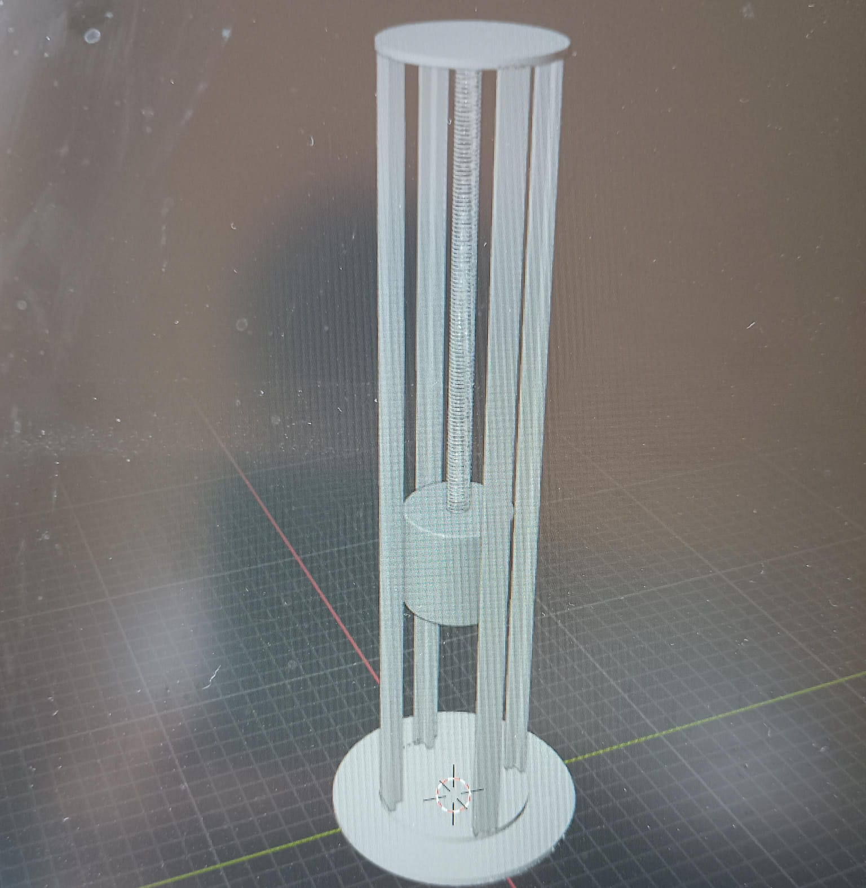
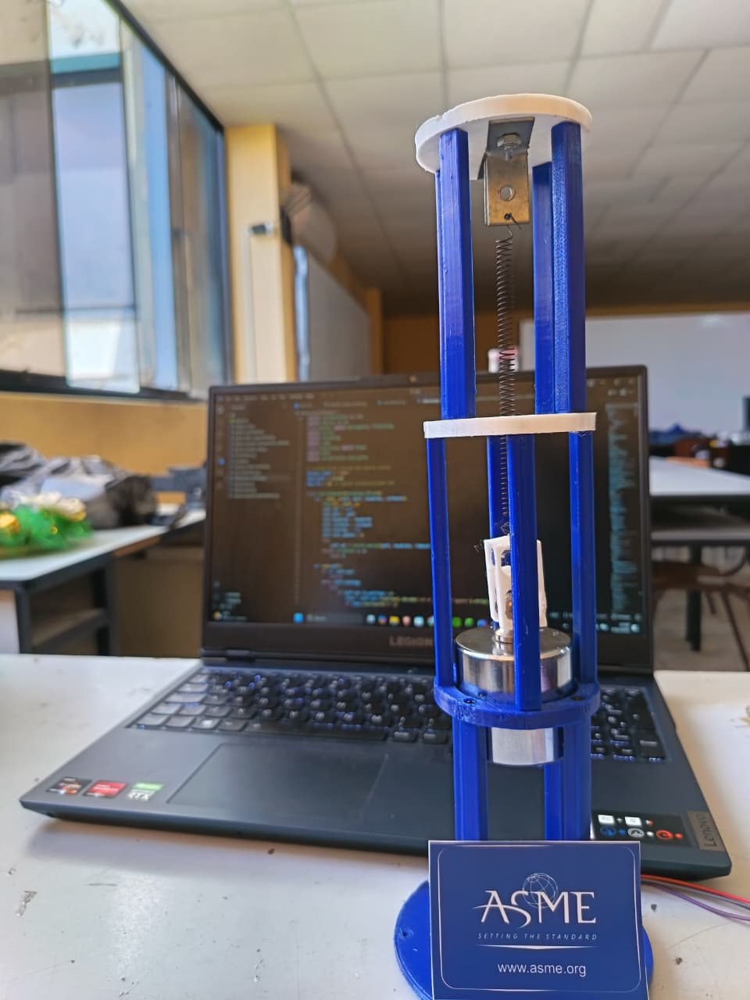

# VibraScope

Sistema experimental y educativo para el estudio de vibraciones mecánicas en tiempo real mediante instrumentación de bajo costo, adquisición de datos con ESP32 y visualización inmediata en Python.

VibraScope nace para cerrar la brecha entre la teoría de los sistemas vibratorios y la experiencia práctica en laboratorio. El proyecto combina un montaje masa-resorte, sensores de distancia VL53L0X, firmware para ESP32 y una interfaz gráfica que permite observar desplazamiento, período y frecuencia mientras el sistema oscila.

## Modelo 1DoF

| Modelo CAD | Prototipo físico |
| --- | --- |
|  |  |

## Qué ofrece el proyecto

- Medición de desplazamiento en tiempo real con sensores VL53L0X.
- Adquisición de datos mediante ESP32 por puerto serial USB.
- Visualización instantánea de posición vs. tiempo en una interfaz gráfica.
- Cálculo experimental de período y frecuencia.
- Registro y exportación de datos para análisis posterior.
- Base escalable para configuraciones de 1 y 2 grados de libertad.

## Enfoque educativo

El objetivo de VibraScope es convertir ecuaciones diferenciales y modelos idealizados en una experiencia tangible. En lugar de quedarse solo en la formulación teórica del sistema masa-resorte

`m x'' + kx = 0`

el estudiante puede excitar el sistema, medir su respuesta y comparar directamente los resultados experimentales con las predicciones del modelo.

## Arquitectura general

### Hardware

- Estructura mecánica modular impresa en 3D.
- Resorte y masa móvil para el experimento vibratorio.
- Sensor láser de tiempo de vuelo `VL53L0X`.
- Microcontrolador `ESP32`.
- Comunicación USB con la aplicación de escritorio.

### Software

- Firmware Arduino para adquisición con uno o dos sensores.
- Aplicación Python con interfaz gráfica basada en `tkinter` y `customtkinter`.
- Comunicación serial con actualización en tiempo real.
- Herramientas de visualización, pausa, referencia relativa y guardado de datos.

## Validación experimental del modelo 1DoF

El material incluido en [`VibraScope_1DoF`](VibraScope_1DoF) documenta una validación experimental del sistema masa-resorte vertical.

Parámetros reportados:

- Masa: `0.5 kg`
- Constante del resorte: `68.125 N/m`
- Período teórico: `0.5383 s`
- Frecuencia teórica: `1.8577 Hz`
- Período experimental: `0.54 s`
- Frecuencia experimental: `1.84 Hz`

Resultado principal:

- El error de frecuencia es menor al `1.5 %`, lo que muestra una muy buena correlación entre el modelo teórico y la medición experimental para fines educativos.

## Estructura del repositorio

```text
VibraScope/
├── VibraScope.py                         # Aplicación para sistema 1DoF
├── VibraScope_2DoF.py                    # Aplicación para sistema 2DoF
├── VibraScope_sensor/
│   └── VibraScope_sensor.ino             # Firmware para un sensor VL53L0X
├── VibraScope_dual_sensor/
│   └── VibraScope_dual_sensor.ino        # Firmware para dos sensores VL53L0X
└── VibraScope_1DoF/
    ├── Paper_ABET.pdf                    # Documento técnico del prototipo
    ├── PPT VibraScope.pdf                # Presentación del proyecto
    ├── vibracope_vertical_1DoF_model.jpeg
    └── vibracope_vertical_1DoF_physical_model.jpeg
```

## Requisitos

### Python

- Python 3.10 o superior recomendado.
- Dependencias mínimas:

```bash
pip install customtkinter pyserial
```

### Arduino / ESP32

- Arduino IDE o PlatformIO.
- Placa ESP32.
- Librería `Adafruit_VL53L0X`.

## Puesta en marcha

### 1. Cargar el firmware al ESP32

Para una configuración de un grado de libertad:

```text
VibraScope_sensor/VibraScope_sensor.ino
```

Para una configuración de dos grados de libertad:

```text
VibraScope_dual_sensor/VibraScope_dual_sensor.ino
```

### 2. Conectar el hardware

- Alimenta el ESP32 por USB.
- Conecta el sensor `VL53L0X` al bus I2C.
- En el caso de dos sensores, usa los pines `XSHUT` para asignar direcciones distintas.

### 3. Ejecutar la interfaz

Sistema 1DoF:

```bash
python VibraScope.py
```

Sistema 2DoF:

```bash
python VibraScope_2DoF.py
```

Luego selecciona el puerto COM disponible desde la interfaz y empieza la adquisición.

## Aplicaciones

- Laboratorios de vibraciones mecánicas.
- Cursos de dinámica y sistemas.
- Demostraciones de movimiento armónico simple.
- Validación básica entre teoría y experimento.
- Desarrollo de prototipos educativos de bajo costo.

## Documentación de apoyo

- [`VibraScope_1DoF/Paper_ABET.pdf`](VibraScope_1DoF/Paper_ABET.pdf)
- [`VibraScope_1DoF/PPT VibraScope.pdf`](VibraScope_1DoF/PPT%20VibraScope.pdf)

## Próximas extensiones naturales

- Vibraciones forzadas.
- Análisis espectral.
- Mayor automatización del procesamiento de señales.
- Nuevas configuraciones con múltiples grados de libertad.

## Créditos

Proyecto desarrollado en el contexto de la enseñanza de vibraciones mecánicas en la Universidad Nacional de Ingeniería, con una orientación clara a instrumentación accesible, validación experimental y uso docente.
